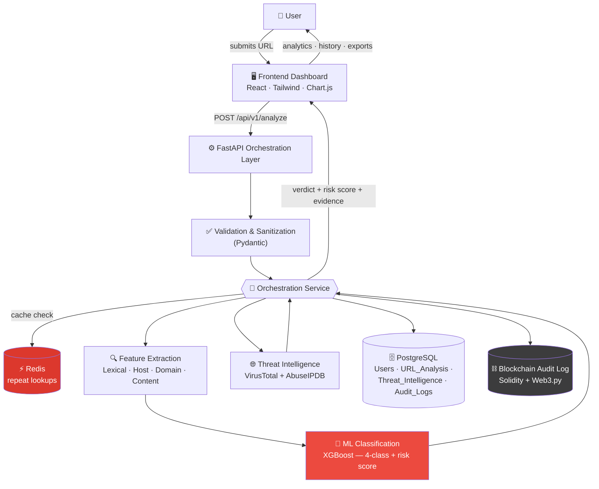
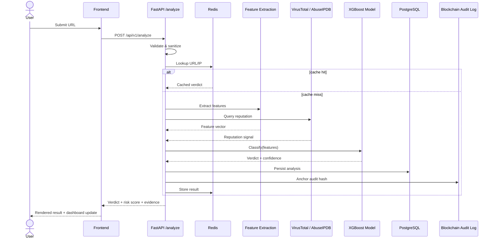
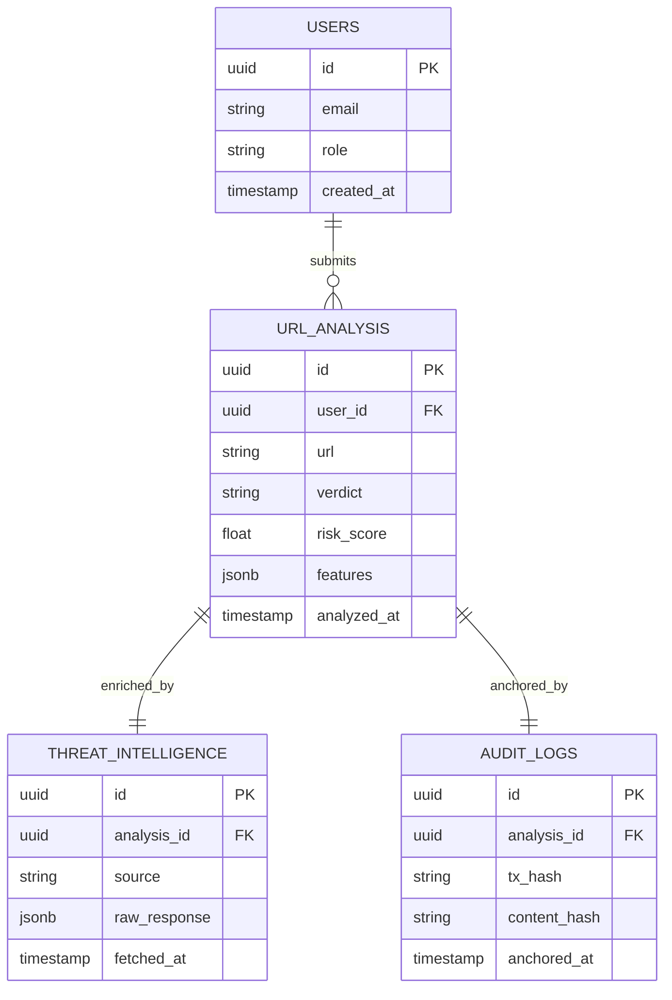
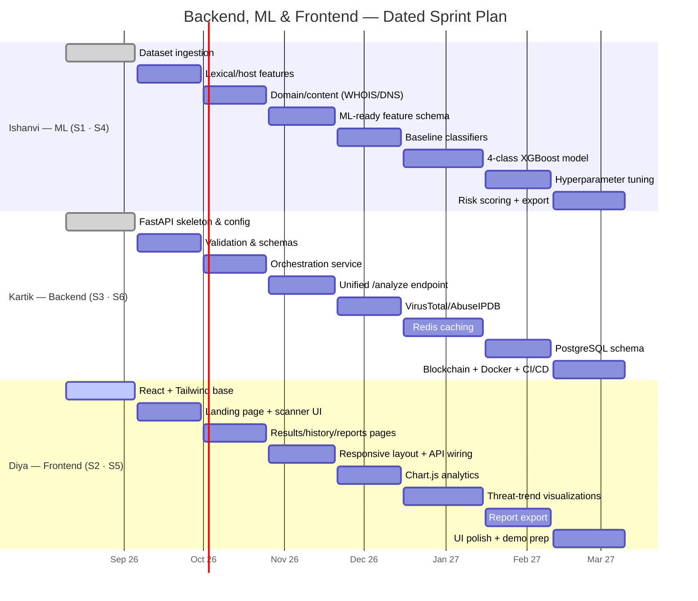

<div align="center">

# 🛡️ Identifying URL-Based Attacks using IP Data

### Hybrid ML + Threat Intelligence + Blockchain platform for real-time malicious URL detection and tamper-proof digital forensics.


**Project ID** `SKIT/AI/2023-2027/07` &nbsp;·&nbsp; **Branch** CSE &nbsp;·&nbsp; **Session** 2026–27 &nbsp;·&nbsp; **Eval** Research Paper Publication

[Problem](#-problem-statement) · [What We're Building](#-what-were-building) · [Architecture](#-high-level-architecture) · [Request Flow](#-request-flow) · [Data Model](#-data-model-proposed) · [Timeline](#-sprint-timeline) · [Stack](#-technology-stack) · [Team](#-team) · [PRD](PRD.md) · [Progress](PROGRESS.md)

</div>

---

## 🎯 Problem Statement

Traditional **blacklist-based** security systems fail to catch **zero-day malicious URLs** — links generated too recently to appear on any known-bad list. They also stitch together URL, IP, and threat-intel signals poorly, and keep logs that can be quietly edited after the fact, so even a correct detection can't always be *proven* later.

**Our fix:** fuse URL feature analysis, IP intelligence, domain reputation, and live threat intelligence into one ML-driven verdict — then anchor that verdict in an **immutable blockchain audit log**, so the record of what was detected, when, and why, can't be tampered with.

---

## 🧩 What We're Building

```
 Input:  a URL, submitted through the dashboard
 Output: ┌─────────────────────────────────────────────┐
         │  Verdict           Benign / Phishing /       │
         │                    Malware / Suspicious       │
         │  Risk Score        0–100, confidence-based    │
         │  Evidence          features + threat-intel    │
         │  Audit Record      hash anchored on-chain      │
         └─────────────────────────────────────────────┘
```

Beyond single-URL scanning: scan history, threat-trend analytics, and exportable audit-ready reports (CSV / JSON / PDF) for decision-makers.

---

## 🏗️ High-Level Architecture



---

## 🔄 Request Flow

*What happens the instant a URL is submitted:*



---

## 🗃️ Data Model (proposed)

*Finalized in Sprint 6 (due 10-02-2027) — shown here to size the schema early.*



---

## 📅 Sprint Timeline



Live status with notes lives in **[PROGRESS.md](PROGRESS.md)**.

---

## 🧰 Technology Stack

| Layer | Stack | Purpose |
|---|---|---|
| 🖥️ **Frontend** | React.js · Tailwind CSS · Chart.js · Axios · React Router | Scanner UI, dashboards, analytics charts |
| ⚙️ **Backend** | Python · FastAPI · Pydantic · Uvicorn | REST APIs, validation, orchestration |
| 🧠 **ML** | Scikit-Learn · XGBoost · Pandas · NumPy | Feature extraction, 4-class classification |
| 🌐 **Threat Intel** | WHOIS/DNS · Scapy · VirusTotal · AbuseIPDB | IP/domain reputation, live signal |
| 🗄️ **Data & Infra** | PostgreSQL · Redis · Solidity · Ganache · Web3.py · Docker | Storage, caching, tamper-proof logs, deployment |

---

## 📂 Repository Layout

```
FinalYearProject/
├── frontend/    React dashboard          — Diya   (Sprint 2 & 5)
├── backend/     FastAPI orchestration    — Kartik (Sprint 3 & 6)
├── ml/          Feature eng + training   — Ishanvi (Sprint 1 & 4)
├── docs/        Diagrams, research notes
├── README.md    ← this file
├── PRD.md       Product requirements
└── PROGRESS.md  Live sprint/task tracker
```

Each of `frontend/`, `backend/`, `ml/` has its own `README.md` with setup steps for that layer.

---

## 👥 Team

| | Name | Role | Sprints |
|---|---|---|---|
| 🧑‍💻 | **Kartik Bhargava** | Team Lead — Backend & Integration | 3, 6 |
| 🤖 | **Ishanvi Agarwal** | ML Engineer | 1, 4 |
| 🎨 | **Diya Garg** | Frontend & UI/UX Developer | 2, 5 |

---

## 🚀 Getting Started

```bash
# Backend
cd backend && python -m venv .venv && .venv/Scripts/activate
pip install -r requirements.txt && cp .env.example .env
uvicorn app.main:app --reload          # → http://127.0.0.1:8000/docs

# ML
cd ml && python -m venv .venv && .venv/Scripts/activate
pip install -r requirements.txt
python -m src.ingest

# Frontend (once scaffolded)
cd frontend && npm install && npm run dev
```

Full Docker Compose orchestration lands with the Sprint 6 deployment task.

---

<div align="center">

📄 Full requirements → **[PRD.md](PRD.md)** &nbsp;·&nbsp; 📊 Live status → **[PROGRESS.md](PROGRESS.md)**

</div>
