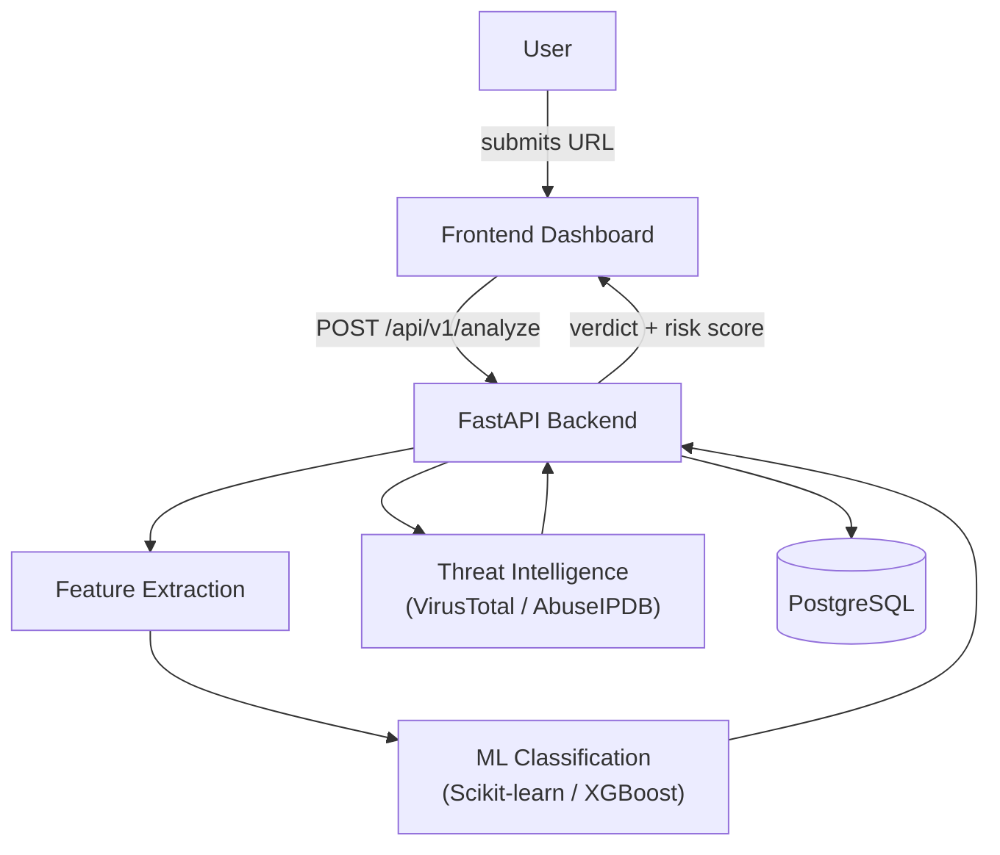
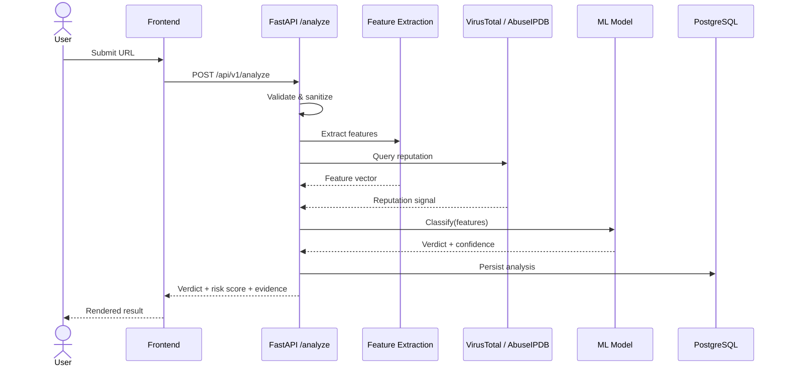
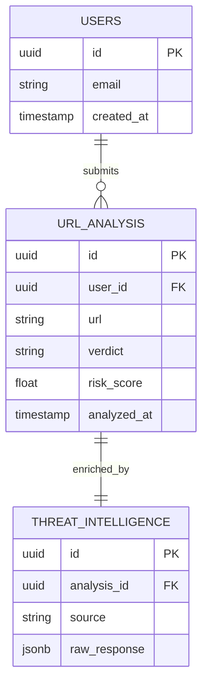
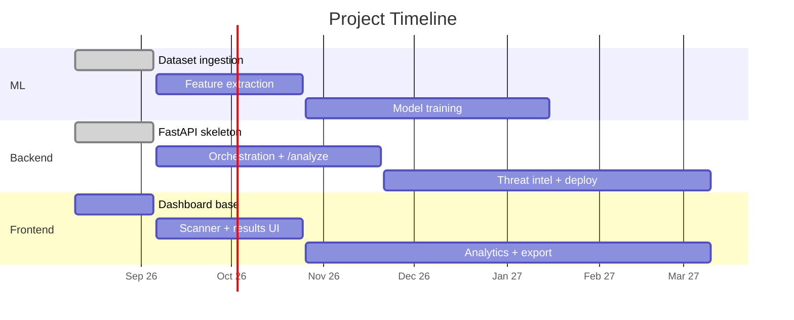

# 🛡️ URL Attack Detection

Real-time detection and classification of malicious URLs using Machine Learning, IP/domain threat intelligence, and a FastAPI backend.

## 👥 Team Members
- Kartik Bhargava — Backend & Integration
- Ishanvi Agarwal — Machine Learning
- Diya Garg — Frontend & UI/UX

---

## 🎯 Problem Statement

Traditional blacklist-based security systems can't catch newly created (zero-day) malicious URLs, since they only block links that are already known to be bad. They also stitch together URL, IP, and threat-intelligence signals poorly.

This project detects and classifies URLs in real time — as **Benign**, **Phishing**, **Malware**, or **Suspicious** — by analyzing the URL's structure, host, and domain information together with live threat intelligence, instead of relying on the URL having been seen before.

## 🧩 What We're Building

A system that takes a submitted URL and returns:
- A **verdict** (Benign / Phishing / Malware / Suspicious)
- A **confidence-based risk score**
- The **evidence** behind it — extracted URL features and threat-intel signals

Plus a dashboard for scan history, threat-trend analytics, and exportable reports.

## ⚙️ How We're Building It

1. **Feature engineering first** — every URL is broken into lexical, host-based, and domain features before any model sees it.
2. **ML does the classification** — a trained model (Scikit-learn / XGBoost) scores each URL, so even previously-unseen (zero-day) URLs can be flagged on structural signal, not just a known-bad list.
3. **External threat intel corroborates the verdict** — VirusTotal / AbuseIPDB results are merged in, not blindly trusted.
4. **Backend orchestrates everything** — one FastAPI endpoint validates the URL, runs feature extraction + ML + threat-intel, and returns one unified result.

---

## 🏗️ Architecture



## 🔄 Request Flow



## 🗃️ Data Model (proposed)



---

## 🎯 Objectives
- Dataset collection
- Feature extraction
- ML model training
- Detection system

## 🧰 Tech Stack

| Layer | Stack |
|---|---|
| Frontend | React.js, Tailwind CSS, Chart.js |
| Backend | Python, FastAPI, Pydantic, Uvicorn |
| ML | Scikit-learn, XGBoost, Pandas, NumPy |
| Threat Intel | WHOIS/DNS, VirusTotal, AbuseIPDB |
| Data | PostgreSQL |

## 📂 Repository Structure

```
backend/
ml/
docs/
weekly_reports/
```

## 📅 Timeline



## 📈 Current Progress

### Week 1
- Built FastAPI backend skeleton (routing, environment config, CORS, health check)
- Assembled benign and malicious URL datasets
- Built dataset ingestion scripts

## 🚀 Setup Instructions

```bash
git clone <repo-url>

# Backend
cd backend
pip install -r requirements.txt
uvicorn app.main:app --reload

# ML
cd ml
pip install -r requirements.txt
python -m src.ingest
```
